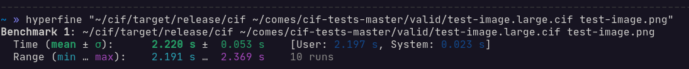

# cif
CIF decoder 

For learning purposes and challenge (https://gist.github.com/liquidev/0b1f6f37a525ae7f3887dc8006da1a6b)

## Build

```shell
git clone https://github.com/reticulis/cif.git
cd cif
RUSTFLAGS="-C target-cpu=native --emit=asm" cargo build --release
```

## Benchmarks
CPU: Intel Xeon E3-1240 V2 \
Kernel: Linux 5.16.8 XANMOD

With clang optimization flags:


Without clang optimization flags:


I used CIF files from https://github.com/comes-group/cif-tests